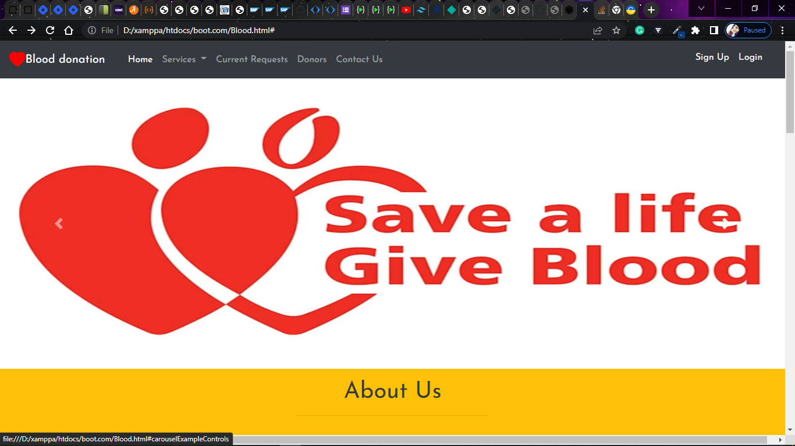

## Blood Donation Portal
> ### It is a static web page made using Bootstrap.

### From this project I've learned:-
- How to use Bootstrap in a project.
- Bootstrap is a lot easy to use and it's a great framework to use when you don't want to make a website from scratch.
- It helps you in making great responsive websites at a very faster pace.

> ### The Screenshot of the site is attached below:-

> ### The link to the site: [Blood donation portal](https://aim-blood-donation-portal.netlify.app/)